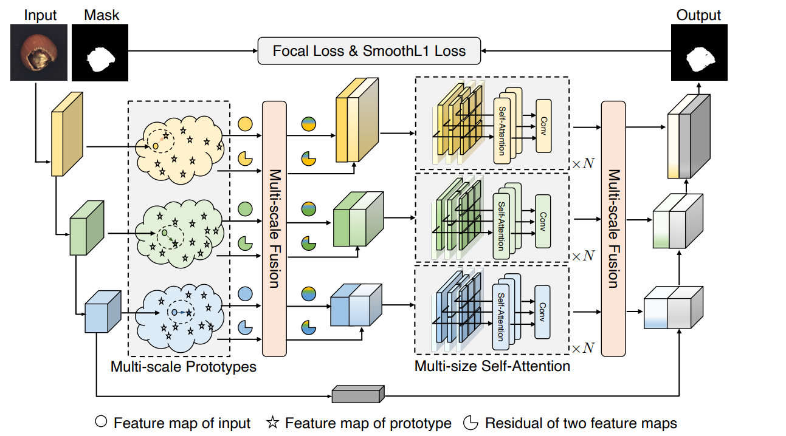

# [Prototypical Residual Networks for Anomaly Detection and Localization](https://openaccess.thecvf.com/content/CVPR2023/papers/Zhang_Prototypical_Residual_Networks_for_Anomaly_Detection_and_Localization_CVPR_2023_paper.pdf)

Unofficial PyTorch implementation for CVPR2023 paper, Prototypical Residual Networks for Anomaly Detection and Localization.

This paper proposes a framework called Prototypical Residual Network (PRN), which learns feature residuals of varying scales and sizes between anomalous and normal patterns to accurately reconstruct the segmentation maps of anomalous regions.


---


## Dataset Preparation

Download the MVTecAD dataset from [here](https://www.mvtec.com/company/research/datasets/mvtec-ad/downloads) and extract it to ``/data/mvtec_anomaly_detection``.
```
mkdir -p /data/mvtec_anomaly_detection
tar -xf mvtec_anomaly_detection.tar.xz -C /data/mvtec_anomaly_detection
```

Download the latest DtD dataset from [here](https://www.robots.ox.ac.uk/~vgg/data/dtd/) and extract the `dtd` folder from inside of it to ``/data/dtd``.
```
tar -xzvf dtd<version>.tar.gz -C /data/
```

## Class Selection
Update `MVTEC.CLASSNAMES` in `./prnet/datasets/mvtec.py` to define which of the MVTecAD classes to train on.

## Docker
Execute the `entrypoint.sh` script to build / run the Docker image
```
chmod +x ./entrypoint.sh && ./entrypoint.sh
```

## Prototype Features Generation

Run the `initialize_prototypes.py` script to initialize prototype features. This only needs to be run once.
```
python create_proto_feature_maps.py
```

## Training and validating

Run the `train.py` script to train and validate on the MVTecAD dataset.
```
python train.py
```

## Reference

```
@InProceedings{Zhang_2023_CVPR,
    author    = {Zhang, Hui and Wu, Zuxuan and Wang, Zheng and Chen, Zhineng and Jiang, Yu-Gang},
    title     = {Prototypical Residual Networks for Anomaly Detection and Localization},
    booktitle = {Proceedings of the IEEE/CVF Conference on Computer Vision and Pattern Recognition (CVPR)},
    month     = {June},
    year      = {2023},
    pages     = {16281-16291}
}
```


## Acknowledgement

Based on https://github.com/xcyao00/PRNet